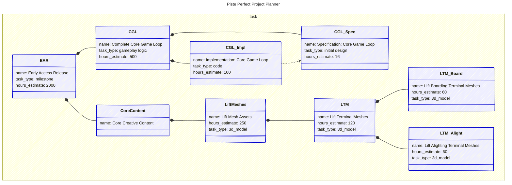

# Mermaid classDiagram Rulesheet

Mapping from Mermaid `classDiagram` syntax to an SQL database export.

## Pipeline

```
Mermaid (.mmd)  -->  AST  -->  SQLite  -->  Supabase  -->  Web UI
```

## Concept Mapping

| Markdown Format                   | Mermaid classDiagram                        | Example                                              |
|-----------------------------------|---------------------------------------------|------------------------------------------------------|
| H1 `@database` heading            | Frontmatter `title:` + `classDiagram` block | `title: My Project`                                  |
| H2 table + SQL schema block       | `namespace <table> { ... }`                 | `namespace task { ... }`                             |
| SQL schema fenced code block      | Commented SQL header (`%%`)                 | `%% CREATE TABLE task (...)`                         |
| H3 row heading                    | `class <Anchor> { ... }`                    | `class EAR { ... }`                                  |
| Heading text (row name)           | `name:` attribute in class body             | `name: Early Access Release`                         |
| `{#anchor}` explicit anchor       | Class identifier                            | `class EAR`                                          |
| `PK: 42` in heading               | `id: 42` attribute in class body            | `id: 42`                                             |
| `#### Columns` key: value         | Attributes in class body                    | `hours_estimate: 500`                                |
| `#### Relationships` (all types)  | Declared arrow syntax                       | `EAR *-- CGL`                                        |
| Junction table (inferred by name) | Explicit FK column mapping                  | `%% parent_task_id *-- child_task_id : task_part_of` |
| Mermaid comment `%%`              | Comments, SQL header, arrow mappings        | `%% sprint 3 tasks`                                  |
| `classDef`                        | Visual styling (no parsing impact)          | `classDef task fill:#eef`                            |

## Rules

### 1. File Structure

One `.mmd` file = one database. The file has four sections in order:

```
---
title: Database Name
config:
    look: handDrawn
---

%% --- SQL schema (CREATE TABLE statements) ---
%% --- Arrow-to-junction-table mappings ---

classDiagram

namespace table_name {
    ...classes (rows)...
}

...relationship arrows...

classDef styles (optional)
```

### 2. SQL Schema Header

Table schemas are declared as commented-out SQL underneath the YAML frontmatter, before the data markup. Each `CREATE TABLE` is prefixed line-by-line with `%%`.

#### Data Tables

```
%% CREATE TABLE task (
%%   task_type TEXT,
%%   hours_estimate INTEGER,
%%   priority INTEGER
%% );
```

Three columns are **auto-managed** and do not need to be declared:

| Column   | Type                   | Behaviour                                                                                                                                                                                         |
|----------|------------------------|---------------------------------------------------------------------------------------------------------------------------------------------------------------------------------------------------|
| `id`     | `INTEGER PRIMARY KEY`  | Auto-assigned on insert. If a row declares `id:`, that value is used for UPSERT (update if exists, insert if not). An integer `id` with no matching row is ignored and a new PK is auto-assigned. |
| `name`   | `TEXT NOT NULL`        | Populated from the `name:` attribute in the class body.                                                                                                                                           |
| `anchor` | `TEXT UNIQUE NOT NULL` | Populated from the class identifier (e.g., `EAR`).                                                                                                                                                |

If the SQL header explicitly declares any of these three columns, the explicit declaration takes precedence (allowing custom constraints). If omitted, sensible defaults are injected.

#### Schema Flexibility

If a row contains an attribute whose key does not match any column in the declared schema, the parser **adds a new column** with that name and type `TEXT`. This allows the schema to grow organically from the data without requiring every column to be pre-declared.

#### Junction Tables

Junction tables declare relationships between rows. A junction table is identified by having exactly **two foreign key columns as its composite primary key**. An optional `label TEXT` column is also allowed.

```
%% CREATE TABLE task_part_of (
%%   parent_task_id INTEGER REFERENCES task(id),
%%   child_task_id INTEGER REFERENCES task(id),
%%   label TEXT,
%%   PRIMARY KEY (parent_task_id, child_task_id)
%% );
%%
%% CREATE TABLE task_depends_on (
%%   dependent_task_id INTEGER REFERENCES task(id),
%%   prerequisite_task_id INTEGER REFERENCES task(id),
%%   label TEXT,
%%   PRIMARY KEY (dependent_task_id, prerequisite_task_id)
%% );
```

FK column names are free-form. The relationship directionality is determined by explicit arrow mappings (see Rule 3).

### 3. Arrow-to-Junction-Table Mappings

After the SQL header, comment directives explicitly map Mermaid arrow syntax to junction tables with FK column names:

```
%% parent_task_id *-- child_task_id : task_part_of
%% dependent_task_id ..> prerequisite_task_id : task_depends_on
```

**Format:** `%% <left_fk_column> <arrow_token> <right_fk_column> : <junction_table_name>`

Each mapping declares:
- **Left FK column name** - the FK column that LHS anchors connect to
- **Arrow token** - any valid Mermaid relationship syntax
- **Right FK column name** - the FK column that RHS anchors connect to
- **Junction table name** - the table containing the relationship

This explicit format removes all ambiguity about relationship directionality and supports all 98 possible arrow combinations.

#### Relationship Semantics

When parsing an arrow like `A *-- B`:
1. Look up the arrow mapping for `*--` → `parent_task_id *-- child_task_id : task_part_of`
2. Check which FK column references A's table → `parent_task_id` references task, A is in task
3. Check which FK column references B's table → `child_task_id` references task, B is in task
4. Create unidirectional relationship: B points to A (B's parent is A)

This follows UML composition convention: `A *-- B` means B is part of A, so the relationship entry is stored on B.

#### Available Arrow Syntax

Mermaid `classDiagram` provides two link styles and seven end markers per side:

**Link styles:** `--` (solid), `..` (dashed)

**End markers:** `<|`, `<`, `*`, `o`, `|>`, `>`, or none

These combine into 98 unique arrow tokens (7 left × 7 right × 2 styles):
- Examples: `*--`, `..>`, `<|--`, `o..o`, `--*`, `<..>`, `*--*`, `o-->`, etc.
- Each arrow token can only map to one junction table per file
- Any valid combination can be user-defined with explicit FK column mappings

#### UML Convention Examples

Common UML arrow patterns and their typical interpretations:

| Arrow | UML Meaning | Example Mapping                                   | Semantic Direction                   |
|-------|-------------|---------------------------------------------------|--------------------------------------|
| `*--` | Composition | `parent_task_id *-- child_task_id : task_part_of` | RHS (child) → LHS (parent)           |
| `o--` | Aggregation | `container_id o-- item_id : container_items`      | RHS (item) → LHS (container)         |
| `-->` | Association | `source_id --> target_id : associations`          | LHS (source) → RHS (target)          |
| `..>` | Dependency  | `dependent_id ..> prerequisite_id : dependencies` | LHS (dependent) → RHS (prerequisite) |
| `<    | --`         | Inheritance                                       | `parent_type_id <                    |-- child_type_id : type_hierarchy` | RHS (subclass) → LHS (superclass) |

The FK column names in the mapping determine the actual directionality, regardless of arrow syntax.

### 4. Tables

A `namespace` declares a table.

```
namespace task {
    ...
}
```

- The namespace identifier is the table name, used directly in SQL.
- Multiple namespaces in one file define multiple tables in the same database.
- All classes inside a namespace belong to that table.
- A namespace must have a corresponding `CREATE TABLE` in the SQL header (or one will be inferred with only auto-managed columns).

### 5. Rows

A `class` inside a namespace declares a row in that table.

```
class EAR{
name: Early Access Release
task_type: milestone
hours_estimate: 2000
}
```

**Class identifier** (e.g., `EAR`) is the row's **anchor** -- a short, unique, human-chosen identifier. Anchors must be unique across the entire file, not just within a table.

**`:::style`** (e.g., `:::task`) is an optional Mermaid CSS class for visual styling. It has **no impact on AST parsing**. It does not need to match the enclosing namespace -- that's a useful convention for readability, not a requirement.

**Class body** contains column values as `key: value` pairs, one per line:
- `name:` (required) -- the human-readable row name.
- `id:` (optional) -- explicit integer primary key for UPSERT. Omit when authoring new rows.
- All other attributes are column values written to the corresponding table column.

### 6. Column Value Types

The **SQL schema is authoritative** for column types. When a column is declared in the schema, values are coerced to the declared type. There is no value sniffing -- a value of `3` in a `TEXT` column remains the string `"3"`.

When a column is **not** declared in the schema (triggering the auto-add-as-TEXT rule), the value is stored as text.

For reference, the value syntax in the Mermaid class body:

| Syntax           | Example                                    |
|------------------|--------------------------------------------|
| Bare value       | `hours_estimate: 500`                      |
| Quoted string    | `name: "Core Game Loop"` (quotes stripped) |
| Boolean keywords | `archived: false`                          |
| Empty (null)     | `due_date:`                                |

### 7. Relationships

Relationships are declared **outside** namespace blocks, as arrows between class anchors. Each arrow type must have a corresponding mapping to a junction table (see Rule 3).

```
EAR *-- CGL
CGL *-- CGL_Spec
CGL *-- CGL_Impl
CGL_Impl ..> CGL_Spec
```

Reading with UML conventions:
- `EAR *-- CGL` -- EAR is composed of CGL. (CGL is part of EAR.)
- `CGL_Impl ..> CGL_Spec` -- CGL_Impl depends on CGL_Spec. (Spec is a prerequisite for Impl.)

The arrow mapping `parent_task_id *-- child_task_id : task_part_of` declares:
- LHS anchor (EAR) connects via `parent_task_id` FK
- RHS anchor (CGL) connects via `child_task_id` FK
- Relationship entry stored on CGL (child points to parent)

#### Labels

Mermaid supports labels on relationship arrows using `: text` syntax:

```
EAR *-- CGL : "core systems"
```

If the mapped junction table has a `label TEXT` column, the label text is stored there. If the junction table has no `label` column, labels are silently ignored.

#### Cross-Table Relationships

Arrows can connect classes from different namespaces. The mapped junction table's FK `REFERENCES` clauses determine which tables are involved. The parser validates that the connected classes belong to the tables referenced by the FKs.

### 8. Comments and Annotations

Mermaid comments (`%%`) serve three purposes in this format:

1. **SQL schema** -- `CREATE TABLE` statements (see Rule 2).
2. **Arrow mappings** -- arrow-to-junction-table directives (see Rule 3).
3. **Human notes** -- everything else is ignored by the parser.

The parser distinguishes these by content: lines starting with `CREATE TABLE` (after `%%` stripping) are SQL, lines matching an arrow token followed by a table name are mappings, and all other comments are ignored.

### 9. Visual Styling

`classDef` defines visual styles per CSS class:

```
classDef task fill:#eeeeff,stroke:#00c
classDef deliverable fill:#eeffee,stroke:#0c0
```

These are purely visual and have **no impact on AST parsing**. They style the rendered Mermaid diagram. The `:::style` suffix on classes references these definitions.

### 10. Frontmatter

The YAML frontmatter between `---` markers configures the diagram:

```yaml
---
title: Database Name
config:
    look: handDrawn
---
```

- `title:` -- the database name (replaces H1 `@database` heading).
- `config:` -- Mermaid rendering configuration (visual only, not parsed as data).

## Validation Rules

1. **Unique anchors** -- class identifiers must be unique across the entire file.
2. **Unique row names** -- `name:` values must be unique within a namespace (table).
3. **`name:` required** -- every class must have a `name:` attribute.
4. **Resolved references** -- every anchor in a relationship arrow must correspond to a declared class.
5. **Arrow mapping required** -- every arrow syntax used in the diagram must have a corresponding junction table mapping in the header.
6. **FK table match** -- classes connected by an arrow must belong to the tables referenced by the mapped junction table's FKs.
7. **No cycles** -- for junction tables whose semantics imply acyclicity (e.g., composition, dependency), the graph formed by that arrow type must be a DAG. The parser can detect this generically: any junction table where both FKs reference the same table is checked for cycles.

## UPSERT Behaviour

- If a row declares `id: <integer>` and a row with that PK exists in the target database, the row is **updated**.
- If a row declares `id: <integer>` and no row with that PK exists, the `id` is **ignored** and a new PK is auto-assigned.
- If no `id:` is declared, matching falls back to `name:` within the table, then to creating a new row.
- Mermaid input can **insert** and **update**, but **never delete**. Deletion is only performed via Supabase directly.

## Ordering (Export)

When exporting from a database back to Mermaid, rows within a namespace are ordered by:

1. Composition hierarchy (parents before children)
2. Dependency topological sort (prerequisites before dependants)
3. `priority` column ascending (lower number = higher importance)
4. `created_utc` ascending (older first)

Relationship arrows are grouped after all namespace blocks.

## Source of Truth

- **Supabase** is the canonical source of truth.
- A complete Mermaid export from the database serves as a backup.
- An empty or partial `.mmd` file cannot delete database contents.

## Full Example



Reading this diagram:
- `EAR *-- CGL` -- EAR (whole) is composed of CGL (part). Diamond on EAR, per UML composition.
- `CGL_Impl ..> CGL_Spec` -- CGL_Impl (dependent) depends on CGL_Spec (prerequisite). Dashed arrow from dependent to dependency, per UML.
- The arrow mapping `parent_task_id *-- child_task_id : task_part_of` declares:
  - LHS of `*--` (EAR) connects to `parent_task_id` FK
  - RHS of `*--` (CGL) connects to `child_task_id` FK
  - Result: CGL (child) has relationship entry pointing to EAR (parent)
- The arrow mapping `dependent_task_id ..> prerequisite_task_id : task_depends_on` declares:
  - LHS of `..>` (CGL_Impl) connects to `dependent_task_id` FK
  - RHS of `..>` (CGL_Spec) connects to `prerequisite_task_id` FK
  - Result: CGL_Impl (dependent) has relationship entry pointing to CGL_Spec (prerequisite)
