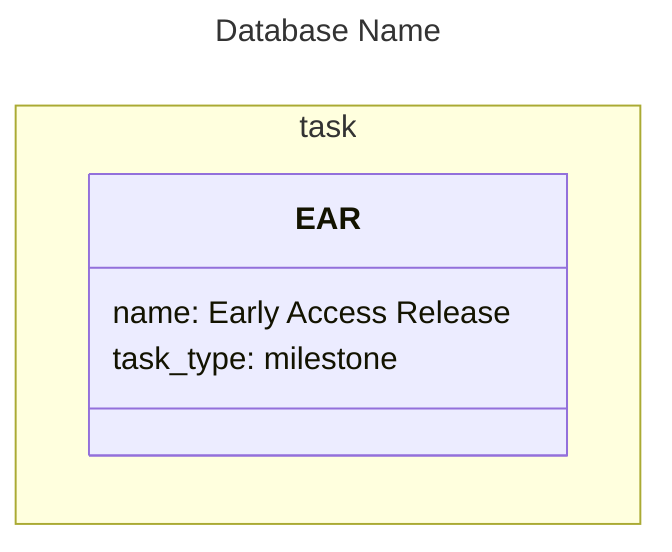

# m2sql Project Tracker

## Overview

A TypeScript monorepo that compiles Mermaid `classDiagram` files into SQLite databases, syncs them to Supabase, and exports them back to Mermaid. Designed to allow authoring project tracking data in plain text from any device (mobile, laptop, offline), with the added benefit that `.mmd` files render as readable diagrams in any Mermaid-compatible viewer.

## Pipeline

```
Mermaid (.mmd)  -->  AST  -->  SQLite  -->  Supabase  -->  Web UI (Next.js)
      ^                                                        |
      |                                                        |
      +--------------------------------------------------------+
                        (export to mermaid)
```

## Core Design Decisions

### Mermaid Format (Authoring)

The authoring format uses Mermaid's `classDiagram` syntax. See `MERMAID_RULESHEET.md` for the full specification.

- **`namespace`** declares a table (e.g., `namespace task { ... }`)
- **`class`** declares a row, with the class identifier as the row's anchor (e.g., `class EAR { ... }`)
- **Class body** contains `key: value` column data, including a required `name:` attribute
- **Arrows** between classes declare relationships, mapped to junction tables via header directives
- **Commented SQL** (`%%`) at the top of the file declares table schemas and arrow-to-junction-table mappings
- **`:::style`** suffix on classes is optional and purely visual (no parsing impact)

### SQL Schema Header

Table schemas are declared as commented-out SQL at the top of the `.mmd` file, after frontmatter. This includes data tables, junction tables, and arrow mappings.

**Arrow mappings** (e.g., `%% parent_task_id *-- child_task_id : task_part_of`) are stored in the SQLite database via a metadata table (`_mermaid_arrow_mappings`) to enable lossless round-trip export. This preserves exact arrow tokens and FK column order.



### Auto-Managed Columns

Three columns are always present on every data table and do not need to be declared in the schema:

| Column   | Type                   | Behaviour                                                |
|----------|------------------------|----------------------------------------------------------|
| `id`     | `INTEGER PRIMARY KEY`  | Auto-assigned. If a row declares `id:`, used for UPSERT. |
| `name`   | `TEXT NOT NULL`        | From the `name:` class attribute.                        |
| `anchor` | `TEXT UNIQUE NOT NULL` | From the class identifier.                               |

### Schema Flexibility

If a row attribute doesn't match a declared column, a new column is added with type `TEXT`. The SQL schema is authoritative for types -- no value sniffing.

### Relationships

Relationship types are not hard-coded. Any valid Mermaid arrow syntax can be mapped to a declared junction table via explicit arrow mappings in the SQL header.

Arrow directions follow UML conventions. The LHS of an arrow maps to the left FK column in the mapping, the RHS to the right FK column.

Junction tables may include an optional `label TEXT` column, populated via Mermaid's `: "label"` syntax on arrows.

### UPSERT Matching

When syncing, rows are matched in this order:
1. By explicit `id:` (if present and a row with that PK exists)
2. By exact `name:` match within the table
3. If neither matches, create a new row

Row names must be unique per table. Anchors must be unique globally.

### Source of Truth

- **Supabase** is the canonical source of truth.
- Mermaid is an authoring/input format that can insert and update rows, but **never delete**.
- Deletion is only performed via Supabase directly.
- A complete Mermaid export from Supabase serves as a backup. An empty or partial `.mmd` file cannot delete database contents.

### Ordering (Export)

When exporting from database to Mermaid, row order within a namespace is derived from:
1. Composition hierarchy (parents before children)
2. Dependency topological sort (prerequisites before dependants)
3. `priority` ascending (lower number = higher importance)
4. `created_utc` ascending (older first)

## Quick Reference

### Example

See `examples/project-planner.mmd` for a working example -- a project tracker for a skiing game with composition and dependency relationships.

### Build Setup

Each package has two tsconfig files:
- `tsconfig.json` — includes all files (source + tests), used by the IDE for type checking
- `tsconfig.build.json` — extends `tsconfig.json` but excludes `*.test.ts`, used by `pnpm build`

Tests use Node.js built-in test runner with `tsx` for TypeScript support: `node --test --import tsx src/**/*.test.ts`

## Implementation Status

### Completed Packages

| Package           | Status     | Tests          | Purpose                                       |
|-------------------|------------|----------------|-----------------------------------------------|
| `@m2sql/model`    | ✅ Complete | 0 (types only) | Shared type definitions, DDL generation       |
| `@m2sql/parser`   | ✅ Complete | 32/32 passing  | Mermaid `.mmd` to semantic model              |
| `@m2sql/sqlite`   | ✅ Complete | 9/9 passing    | Model to SQLite compilation & extraction      |
| `@m2sql/supabase` | ✅ Complete | Manual testing | Model to Supabase push/pull (cloud sync)      |
| `@m2sql/cli`      | ✅ Complete | Manual testing | Command-line interface                        |
| `@m2sql/renderer` | ✅ Complete | 15/15 passing  | Model to Mermaid export (lossless round-trip) |

### Not Yet Started

| Package           | Purpose                              |
|-------------------|--------------------------------------|
| `apps/web`        | Next.js visualization dashboard      |

### @m2sql/model

**Implemented:**
- `types.ts` - Semantic model interfaces: `Database`, `Table`, `Row`, `ColumnValues`, `Relationships`, `ParseResult`, `ValidationResult`
- `schema.ts` - SQL `CREATE TABLE` parser producing `TableSchema` with columns, primary keys, foreign keys, constraints

### @m2sql/parser

**Implemented:**
- 7-phase Mermaid `classDiagram` parser
- SQL header parsing (CREATE TABLE + arrow mappings)
- Frontmatter YAML extraction
- Namespace → table, class → row mapping
- Arrow parsing with junction table resolution
- Validation: unique anchors, cycle detection, FK table matching
- **32/32 tests passing** (461ms duration)

### @m2sql/sqlite

**Implemented:**
- `compileToSqlite(databases)` - Creates tables, inserts rows with FK resolution
- Auto-managed column injection (`id`, `name`, `anchor`)
- Junction table compilation with anchor→ID translation
- **Metadata table (`_mermaid_arrow_mappings`)** for lossless round-trip
- `extractFromDb(db)` - Extracts Database model from SQLite (including metadata)
- Schema flexibility (auto-add TEXT columns)
- Uses `sql.js` (WASM-based SQLite)
- **9/9 tests passing** (569ms duration)

### @m2sql/cli

**Implemented:**
- `compile` command: `.mmd` → `.db` file
- `validate` command: syntax checking without compilation
- Proper error handling and user feedback
- Verbose mode for detailed output
- **All commands tested and working**

**Usage:**
```bash
# From project root (via workspace script)
pnpm m2sql compile examples/project-planner.mmd -v
pnpm m2sql validate examples/project-planner.mmd
pnpm m2sql help

# Or install globally
cd packages/cli && pnpm link --global
m2sql compile input.mmd -o output.db
```

### @m2sql/renderer

**Implemented:**
- `renderToMermaid(database)` - Exports Database model to `.mmd` format
- **Lossless round-trip** using metadata table approach
- Topological sort for row ordering (composition, dependencies, priority, created_utc)
- YAML frontmatter generation
- SQL header rendering with %% prefix (consistent indentation, semicolons)
- Namespace and class rendering
- Arrow declarations via FK ID → anchor joins
- Includes `id:` in exported rows for round-trip UPSERT
- **15/15 tests passing** (602ms duration)

**Features:**
- **Metadata table (`_mermaid_arrow_mappings`)** stores exact arrow tokens and FK column order
- No inference or guessing - preserves exact arrow syntax from original
- Handles empty tables gracefully
- Escapes special characters in values
- Optional classDef styling

**Lossless Round-Trip:**
The pipeline now achieves perfect lossless round-trip: `Mermaid → SQLite → Mermaid → SQLite...`
- Arrow tokens (`*--`, `..>`, etc.) preserved exactly
- FK column order (LHS vs RHS) preserved exactly
- All relationship direction maintained
- Full integration test validates complete round-trip with example file

### @m2sql/supabase

**Implemented:**
- `pushToSupabase(database, supabase)` - Push Database model to Supabase cloud
- `pullFromSupabase(supabase, databaseName)` - Pull Database model from Supabase
- **Dialect-agnostic DDL generation** (`@m2sql/model/ddl.ts`) - shared between SQLite & PostgreSQL
- Auto-managed column injection (`id`, `name`, `anchor`) for PostgreSQL
- UPSERT logic (match by id → name → insert new)
- Junction table handling with anchor→ID resolution
- Metadata table sync (`_mermaid_arrow_mappings`) for lossless round-trips
- Schema introspection via RPC functions
- PostgREST schema cache management
- **Successfully tested with full round-trip** (semantically lossless)

**Architecture:**
Uses hub-and-spoke architecture with Database model as central format:
```
         Database Model (AST)
         /       |        \
    Mermaid   SQLite   Supabase
```

**Setup Requirements:**
- Requires RPC functions in Supabase (see `packages/supabase/setup.sql`)
- Functions: `exec_sql`, `table_exists`, `get_table_names`, `get_columns`, `get_primary_keys`, `get_foreign_keys`
- Authentication via environment variables or CLI flags

**CLI Integration:**
- `push` command: Mermaid → Supabase
- `pull` command: Supabase → Mermaid
- `sync` command: SQLite → Supabase

**Round-Trip Validation:**
Tested with `examples/project-planner.mmd`:
- ✅ All 9 tasks preserved
- ✅ All 9 relationships preserved (8 part-of + 1 depends-on)
- ✅ Arrow tokens preserved (`*--`, `..>`)
- ✅ Metadata table synced correctly
- ✅ Semantically lossless (cosmetic differences: DB-assigned IDs, string quoting, ordering)

## What's Next

### Recently Completed
- ✅ **@m2sql/renderer** - Lossless round-trip with metadata table (15/15 tests passing)
- ✅ **@m2sql/supabase** - Cloud sync with Supabase (full round-trip validated)

### Priority Order

1. **Web UI** (`apps/web`) - NEXT
   - Next.js visualization dashboard
   - Graphical views: node graphs, Gantt charts, tree views
   - Supabase real-time integration
   - Export to Mermaid via renderer
   - Enables: Visual project tracking interface

## CLI Commands

### Currently Available

```bash
# Compile Mermaid to SQLite
pnpm m2sql compile project.mmd
pnpm m2sql compile project.mmd -o output.db -v

# Validate syntax
pnpm m2sql validate project.mmd -v

# Push to Supabase (Mermaid → Cloud)
pnpm m2sql push project.mmd --url <supabase-url> --key <anon-key> -v
# Or use environment variables: SUPABASE_URL and SUPABASE_KEY
pnpm m2sql push project.mmd -v

# Pull from Supabase (Cloud → Mermaid)
pnpm m2sql pull -o backup.mmd --url <url> --key <key> -v
pnpm m2sql pull -o backup.mmd --database "Project Name" -v

# Sync SQLite to Supabase
pnpm m2sql sync tracker.db --url <url> --key <key> -v

# Help and version
pnpm m2sql help
pnpm m2sql version
```

### Authentication

Set environment variables in `.env` file:
```bash
SUPABASE_URL=https://your-project.supabase.co
SUPABASE_KEY=your-anon-key
```

Or pass via CLI flags: `--url` and `--key`

## Tech Stack

**Current:**
- **Language:** TypeScript 5.7
- **Monorepo:** pnpm workspaces
- **Mermaid parsing:** Custom 7-phase classDiagram parser
- **SQLite:** sql.js 1.13 (WASM-based, no native compilation)
- **Supabase client:** @supabase/supabase-js 2.39
- **PostgreSQL:** Via Supabase with RPC functions for DDL/schema introspection
- **Test runner:** Node.js built-in test runner with tsx
- **CLI framework:** Native argument parsing, dotenv for env vars

**Planned:**
- **Web framework:** Next.js
- **Visualization:** Mermaid.js, recharts, react-flow

## Development Workflow

```bash
# Install dependencies
pnpm install

# Build all packages
pnpm build

# Run all tests
pnpm test

# Use CLI from project root
pnpm m2sql compile examples/project-planner.mmd -v

# Watch mode for development
cd packages/parser && pnpm test --watch
```

## Project Structure

```
m2sql-project-tracker/
├── packages/
│   ├── model/          ✅ Types, schema parsing, DDL generation
│   ├── parser/         ✅ Mermaid → AST (32 tests)
│   ├── sqlite/         ✅ AST → SQLite with metadata (9 tests)
│   ├── supabase/       ✅ AST ↔ Supabase cloud sync
│   ├── renderer/       ✅ Lossless round-trip export (15 tests)
│   └── cli/            ✅ Command-line interface (push/pull/sync)
├── apps/
│   └── web/            🚧 Next.js dashboard (NEXT)
├── examples/
│   └── project-planner.mmd    Working example
├── MERMAID_RULESHEET.md       Complete specification
├── LOSSLESS_ROUNDTRIP_PLAN.md Implementation details
├── SUPABASE_INTEGRATION.md    Supabase setup & implementation
└── PROJECT_SUMMARY.md         This file

Legend: ✅ Complete | 🚧 Not started
```

## Recent Development (2026-02-06)

### Completed: Supabase Cloud Sync Integration

Successfully implemented and validated full bidirectional sync between Mermaid/SQLite and Supabase PostgreSQL.

**Key Features:**
1. **Hub-and-spoke architecture** - Database model as universal interchange format
2. **Dialect-agnostic DDL** - Shared SQL generation for SQLite and PostgreSQL
3. **Push/Pull/Sync commands** - Full CLI integration with authentication
4. **Metadata preservation** - Arrow mappings synced to `_mermaid_arrow_mappings` table
5. **UPSERT logic** - Smart matching (id → name → insert)
6. **Schema introspection** - RPC functions for reading PostgreSQL schema
7. **PostgREST cache management** - Automatic schema reload after DDL operations

**Round-Trip Validation:**
Tested `examples/project-planner.mmd` → Supabase → Mermaid:
- ✅ All 9 tasks preserved with correct data
- ✅ All 9 relationships preserved (8 part-of + 1 depends-on)
- ✅ Arrow tokens preserved (`*--`, `..>`)
- ✅ Metadata table synced correctly
- ✅ **Semantically lossless** (cosmetic differences: IDs, quoting, ordering)

**Implementation Details:**
- Created `@m2sql/supabase` package with push/pull functions
- Moved column injection logic to shared `@m2sql/model/ddl.ts`
- Updated SQLite compiler to use shared DDL generator
- Added RPC functions in Supabase for schema introspection
- CLI commands: `push`, `pull`, `sync` with environment variable support

**Test Results:** 56/56 tests passing
- Parser: 32/32
- SQLite: 9/9
- Renderer: 15/15
- Supabase: Manual validation (full round-trip successful)

**Next Steps:**
Web UI (`apps/web`) for visual project tracking with Supabase real-time integration.
```
