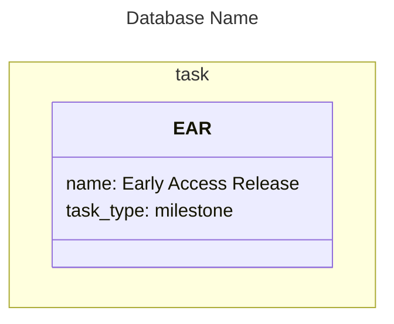

# m2sql Project Tracker

## Overview

A TypeScript monorepo that compiles Mermaid `classDiagram` files into SQLite databases, syncs them to Supabase, and exports them back to Mermaid. Designed to allow authoring project tracking data in plain text from any device (mobile, laptop, offline), with the added benefit that `.mmd` files render as readable diagrams in any Mermaid-compatible viewer.

## Pipeline

```
Mermaid (.mmd)  -->  AST  -->  SQLite  -->  Supabase  -->  Web UI (Next.js)
      ^                                                        |
      |                                                        |
      +--------------------------------------------------------+
                        (export to mermaid)
```

## Core Design Decisions

### Mermaid Format (Authoring)

The authoring format uses Mermaid's `classDiagram` syntax. See `MERMAID_RULESHEET.md` for the full specification.

- **`namespace`** declares a table (e.g., `namespace task { ... }`)
- **`class`** declares a row, with the class identifier as the row's anchor (e.g., `class EAR { ... }`)
- **Class body** contains `key: value` column data, including a required `name:` attribute
- **Arrows** between classes declare relationships, mapped to junction tables via header directives
- **Commented SQL** (`%%`) at the top of the file declares table schemas and arrow-to-junction-table mappings
- **`:::style`** suffix on classes is optional and purely visual (no parsing impact)

### SQL Schema Header

Table schemas are declared as commented-out SQL at the top of the `.mmd` file, after frontmatter. This includes data tables, junction tables, and arrow mappings:



### Auto-Managed Columns

Three columns are always present on every data table and do not need to be declared in the schema:

| Column   | Type                   | Behaviour                                                |
|----------|------------------------|----------------------------------------------------------|
| `id`     | `INTEGER PRIMARY KEY`  | Auto-assigned. If a row declares `id:`, used for UPSERT. |
| `name`   | `TEXT NOT NULL`        | From the `name:` class attribute.                        |
| `anchor` | `TEXT UNIQUE NOT NULL` | From the class identifier.                               |

### Schema Flexibility

If a row attribute doesn't match a declared column, a new column is added with type `TEXT`. The SQL schema is authoritative for types -- no value sniffing.

### Relationships

Relationship types are not hard-coded. Any valid Mermaid arrow syntax can be mapped to a declared junction table via explicit arrow mappings in the SQL header.

Arrow directions follow UML conventions. The LHS of an arrow maps to the left FK column in the mapping, the RHS to the right FK column.

Junction tables may include an optional `label TEXT` column, populated via Mermaid's `: "label"` syntax on arrows.

### UPSERT Matching

When syncing, rows are matched in this order:
1. By explicit `id:` (if present and a row with that PK exists)
2. By exact `name:` match within the table
3. If neither matches, create a new row

Row names must be unique per table. Anchors must be unique globally.

### Source of Truth

- **Supabase** is the canonical source of truth.
- Mermaid is an authoring/input format that can insert and update rows, but **never delete**.
- Deletion is only performed via Supabase directly.
- A complete Mermaid export from Supabase serves as a backup. An empty or partial `.mmd` file cannot delete database contents.

### Ordering (Export)

When exporting from database to Mermaid, row order within a namespace is derived from:
1. Composition hierarchy (parents before children)
2. Dependency topological sort (prerequisites before dependants)
3. `priority` ascending (lower number = higher importance)
4. `created_utc` ascending (older first)

## Quick Reference

### Example

See `examples/project-planner.mmd` for a working example -- a project tracker for a skiing game with composition and dependency relationships.

### Build Setup

Each package has two tsconfig files:
- `tsconfig.json` — includes all files (source + tests), used by the IDE for type checking
- `tsconfig.build.json` — extends `tsconfig.json` but excludes `*.test.ts`, used by `pnpm build`

Tests use Node.js built-in test runner with `tsx` for TypeScript support: `node --test --import tsx src/**/*.test.ts`

## Implementation Status

### Completed Packages

| Package         | Status     | Tests          | Purpose                                     |
|-----------------|------------|----------------|---------------------------------------------|
| `@m2sql/model`  | ✅ Complete | 0 (types only) | Shared type definitions, SQL schema parsing |
| `@m2sql/parser` | ✅ Complete | 32/32 passing  | Mermaid `.mmd` to semantic model            |
| `@m2sql/sqlite` | ✅ Complete | 9/9 passing    | Model to SQLite compilation                 |
| `@m2sql/cli`    | ✅ Complete | Manual testing | Command-line interface                      |

### Not Yet Started

| Package           | Purpose                                         |
|-------------------|-------------------------------------------------|
| `@m2sql/renderer` | Model to Mermaid export (round-trip capability) |
| `@m2sql/supabase` | SQLite ↔ Supabase bidirectional sync            |
| `apps/web`        | Next.js visualization dashboard                 |

### @m2sql/model

**Implemented:**
- `types.ts` - Semantic model interfaces: `Database`, `Table`, `Row`, `ColumnValues`, `Relationships`, `ParseResult`, `ValidationResult`
- `schema.ts` - SQL `CREATE TABLE` parser producing `TableSchema` with columns, primary keys, foreign keys, constraints

### @m2sql/parser

**Implemented:**
- 7-phase Mermaid `classDiagram` parser
- SQL header parsing (CREATE TABLE + arrow mappings)
- Frontmatter YAML extraction
- Namespace → table, class → row mapping
- Arrow parsing with junction table resolution
- Validation: unique anchors, cycle detection, FK table matching
- **32/32 tests passing** (461ms duration)

### @m2sql/sqlite

**Implemented:**
- `compileToSqlite(databases)` - Creates tables, inserts rows with FK resolution
- Auto-managed column injection (`id`, `name`, `anchor`)
- Junction table compilation with anchor→ID translation
- Schema flexibility (auto-add TEXT columns)
- Uses `sql.js` (WASM-based SQLite)
- **9/9 tests passing** (117ms duration)

### @m2sql/cli

**Implemented:**
- `compile` command: `.mmd` → `.db` file
- `validate` command: syntax checking without compilation
- Proper error handling and user feedback
- Verbose mode for detailed output
- **All commands tested and working**

**Usage:**
```bash
# From project root (via workspace script)
pnpm m2sql compile examples/project-planner.mmd -v
pnpm m2sql validate examples/project-planner.mmd
pnpm m2sql help

# Or install globally
cd packages/cli && pnpm link --global
m2sql compile input.mmd -o output.db
```

## What's Next

### Priority Order

1. **@m2sql/renderer** (CRITICAL - blocks everything else)
   - Export semantic model → `.mmd` format
   - Topological sort for row ordering
   - Include `id:` in exported rows for round-trip UPSERT
   - Enables: Round-trip editing, CLI export command

2. **@m2sql/supabase**
   - SQLite ↔ Supabase bidirectional sync
   - UPSERT logic with anchor-based FK resolution
   - Insert/update only (no deletion)
   - Enables: Multi-user collaboration, cloud backup

3. **Web UI** (`apps/web`)
   - Next.js visualization dashboard
   - Graphical views: node graphs, Gantt charts, tree views
   - Supabase real-time integration
   - Enables: Visual project tracking interface

## CLI Commands

### Currently Available

```bash
# Compile Mermaid to SQLite
pnpm m2sql compile project.mmd
pnpm m2sql compile project.mmd -o output.db -v

# Validate syntax
pnpm m2sql validate project.mmd -v

# Help and version
pnpm m2sql help
pnpm m2sql version
```

### Planned (After Renderer & Supabase)

```bash
# Export from Supabase to Mermaid
m2sql export --project <url> --key <key> -o backup.mmd

# Sync SQLite to Supabase
m2sql sync tracker.db --project <url> --key <key>
```

## Tech Stack

**Current:**
- **Language:** TypeScript 5.7
- **Monorepo:** pnpm workspaces
- **Mermaid parsing:** Custom 7-phase classDiagram parser
- **SQLite:** sql.js 1.13 (WASM-based, no native compilation)
- **Test runner:** Node.js built-in test runner with tsx
- **CLI framework:** Native argument parsing (no dependencies)

**Planned:**
- **Supabase client:** @supabase/supabase-js
- **Web framework:** Next.js
- **Visualization:** Mermaid.js, recharts, react-flow

## Development Workflow

```bash
# Install dependencies
pnpm install

# Build all packages
pnpm build

# Run all tests
pnpm test

# Use CLI from project root
pnpm m2sql compile examples/project-planner.mmd -v

# Watch mode for development
cd packages/parser && pnpm test --watch
```

## Project Structure

```
m2sql-project-tracker/
├── packages/
│   ├── model/          ✅ Types and schema parsing
│   ├── parser/         ✅ Mermaid → AST (32 tests)
│   ├── sqlite/         ✅ AST → SQLite (9 tests)
│   ├── cli/            ✅ Command-line interface
│   ├── renderer/       🚧 AST → Mermaid export
│   └── supabase/       🚧 SQLite ↔ Supabase sync
├── apps/
│   └── web/            🚧 Next.js dashboard
├── examples/
│   └── project-planner.mmd    Working example
├── MERMAID_RULESHEET.md       Complete specification
└── project_summary.md         This file

Legend: ✅ Complete | 🚧 Not started
```
