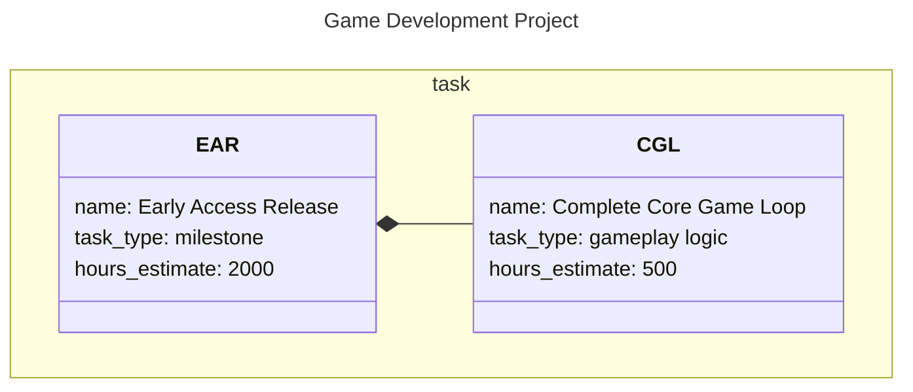

# m2sql Project Tracker

A TypeScript toolkit for managing project data as **Mermaid diagrams** with **SQLite** and **Supabase** backends. Author your projects in plain text, visualize them as diagrams, and sync to the cloud.

## Quick Start

```bash
# Install dependencies
pnpm install

# Build all packages
pnpm build

# Compile Mermaid to SQLite
pnpm m2sql compile examples/project-planner.mmd -v

# Push to Supabase (requires setup - see below)
pnpm m2sql push examples/project-planner.mmd -v

# Pull from Supabase
pnpm m2sql pull -o backup.mmd -v
```

## Features

- ✅ **Mermaid Authoring** - Write project data as readable diagrams
- ✅ **SQLite Compilation** - Convert to local SQLite database
- ✅ **Supabase Sync** - Cloud backup and multi-device sync
- ✅ **Lossless Round-Trip** - Perfect preservation through metadata tables
- ✅ **UPSERT Logic** - Smart conflict resolution (id → name → insert)
- ✅ **Relationship Tracking** - Composition and dependency arrows
- ✅ **Auto-Managed Columns** - id, name, anchor automatically handled

## Architecture

```
Mermaid (.mmd) ←→ Database Model (AST) ←→ SQLite (.db)
                         ↕
                   Supabase (cloud)
```

**Hub-and-Spoke Design**: The Database model is the central interchange format. All three formats (Mermaid, SQLite, Supabase) can convert to/from it.

## Example



See `examples/project-planner.mmd` for a complete working example.

## CLI Commands

### Local Operations

```bash
# Compile Mermaid to SQLite
m2sql compile project.mmd -o output.db -v

# Validate Mermaid syntax
m2sql validate project.mmd -v
```

### Cloud Sync (Supabase)

```bash
# Push to Supabase
m2sql push project.mmd --url <url> --key <key> -v

# Pull from Supabase
m2sql pull -o backup.mmd --database "Project Name" -v

# Sync SQLite to Supabase
m2sql sync project.db --url <url> --key <key> -v
```

**Authentication**: Set `SUPABASE_URL` and `SUPABASE_KEY` in `.env` file, or pass via `--url` and `--key` flags.

## Supabase Setup

1. **Create Supabase project** at https://supabase.com

2. **Run setup SQL** in Supabase SQL Editor:
   ```bash
   cat packages/supabase/setup.sql
   ```
   This creates RPC functions for schema introspection and DDL operations.

3. **Set environment variables** in `.env`:
   ```bash
   SUPABASE_URL=https://your-project.supabase.co
   SUPABASE_KEY=your-anon-key
   ```

4. **Test the integration**:
   ```bash
   pnpm m2sql push examples/project-planner.mmd -v
   pnpm m2sql pull -o test.mmd -v
   ```

See `SUPABASE_INTEGRATION.md` for complete setup instructions.

## Project Structure

```
packages/
├── model/          Types, schema parsing, DDL generation
├── parser/         Mermaid → Database model (32 tests)
├── sqlite/         Database model ↔ SQLite (9 tests)
├── supabase/       Database model ↔ Supabase (validated)
├── renderer/       Database model → Mermaid (15 tests)
└── cli/            Command-line interface

examples/
└── project-planner.mmd    Working example
```

## Documentation

- **PROJECT_SUMMARY.md** - Complete implementation status and architecture
- **MERMAID_RULESHEET.md** - Mermaid syntax specification
- **LOSSLESS_ROUNDTRIP_PLAN.md** - Metadata table design
- **SUPABASE_INTEGRATION.md** - Supabase setup and validation

## Key Design Decisions

### Auto-Managed Columns

Every data table automatically gets three columns (no need to declare):
- `id` - Auto-incrementing primary key
- `name` - From the class `name:` attribute
- `anchor` - From the class identifier

### UPSERT Matching

When syncing, rows are matched in this order:
1. By explicit `id:` (if present)
2. By exact `name:` match
3. If neither matches, create new row

### Lossless Round-Trips

Arrow tokens and relationship directions are preserved via the `_mermaid_arrow_mappings` metadata table. This enables perfect round-trip conversion:

```
Mermaid → SQLite → Mermaid → SQLite → Supabase → Mermaid
```

No data loss, no inference guessing.

## Tech Stack

- **TypeScript 5.7** - Type-safe codebase
- **pnpm workspaces** - Monorepo management
- **sql.js** - WASM SQLite (no native compilation)
- **@supabase/supabase-js** - Cloud sync client
- **Node.js test runner** - Built-in testing with tsx

## Development

```bash
# Install dependencies
pnpm install

# Build all packages
pnpm build

# Run all tests
pnpm test

# Watch mode
cd packages/parser && pnpm test --watch

# Use CLI from project root
pnpm m2sql help
```

## Test Results

```
✅ Parser:   32/32 passing
✅ SQLite:    9/9 passing
✅ Renderer: 15/15 passing
✅ Supabase: Round-trip validated
```

## What's Next

- **Web UI** - Next.js dashboard with graphical editing
- **Real-time collaboration** - Via Supabase subscriptions
- **Advanced visualization** - Gantt charts, network graphs
- **Mobile app** - React Native with offline-first sync

## License

[Your License Here]

## Contributing

[Your Contributing Guidelines Here]
