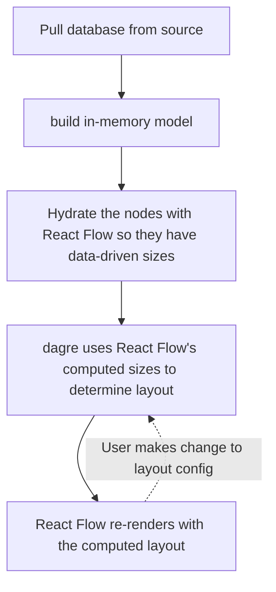

# React Flow as Gantt Chart

The React Flow renderer now has nearly all the features to make an effective Gantt chart renderer. The next development
push will be focused on reaching that goal.

## Required Features

1. Choose top/left/bottom/right as the root side of the viewport. Gantt charts flow left to right chronologically.
   -`graph.rankdir` on `dagre`
2. +/- spacing between nodes (siblings and generational spacing)
    - `rowsep` and `ranksep` exposed as UI configurable
3. Space taken up by node in the layout corresponds to the size it renders as.
    - React Flow needs to initialize the nodes _before_ dagre runs, so dagre can read the computed size.
    - dagre needs to listen for when the nodes have been initialized and their sizes computed, but after it injects the
      positions, it needs to avoid trying to update again when React Flow has responded to this positional data being
      added.
4. Rendered size of the node can be driven by a numerical value the node owns.
    - The min height and min width are currently hard-coded as CSS values.
    - When using data-driven sizing, the node's root div would need to compute a size from the supplied data, and use
      this

